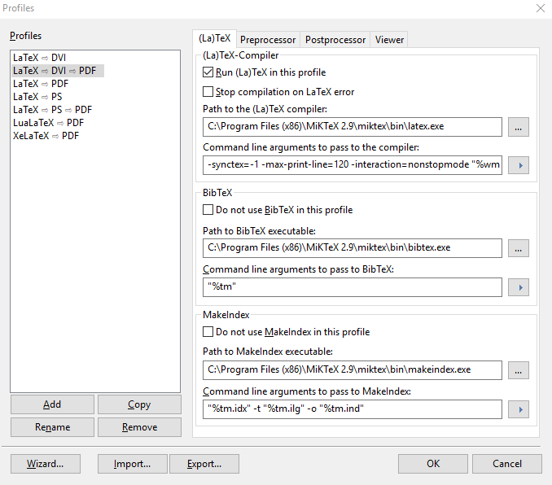
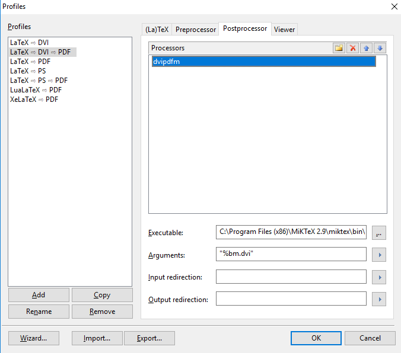

# SIGCSE Start

Template for starting a SIGCE LaTex paper.

## Tools

Currently built on Windows with [TeXnicCenter]( http://www.texniccenter.org/).

See also [8 Best LaTeX Editors](https://beebom.com/best-latex-editors/).

## Next Conference

SIGCSE 2019 - the 50th Conference! 

Minneapolis, MN

Wed Feb 27 - Sat Mar 2, 2019

## Set up

You can double-click the .tcp file to open any project from Windows Explorer if you like.

To build a new PDF after changes, we have to configure the project (do this just once). 

1. Build / Select Output Profile / Latex -> DVI -> PDF / OK
2. Build / Define Output Profile / Latex -> DVI -> PDF

Profile example configuration

## Build

Once the profile is set up, to build, just:

1. Build / Make Index
2. Build / Bibtex
3. Build / Build and View Output

May need to repeat 1 & 2 a couple times before 3 works as expected.  Result should equal a view of the updated PDF.

## References

* [2019 SIGCSE](https://sigcse2019.sigcse.org/)
* [2019 CFP](https://sigcse2019.sigcse.org/SIGCSE_2019_CFP.pdf)